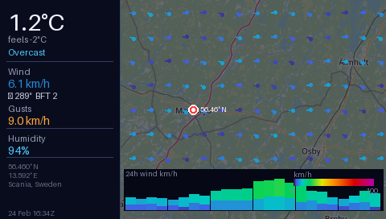

# STM32F746G-DISCO Windy Display

[](https://github.com/MYBLtd/746Disco_Windy/actions/workflows/build.yml)

Live weather map for the **STM32F746G-DISCO** evaluation board, rendered on the
onboard 480×272 TFT LCD.  Inspired by [Windy.com](https://www.windy.com/56.460/13.592?56.111,13.592,8).



---

## What it shows

A Windy-style weather map centred on **56.460 °N, 13.592 °E** (Scania, southern Sweden):

| Element | Source |
|---------|--------|
| Map tiles | OpenStreetMap (zoom 9) |
| Current conditions (T, wind, humidity) | [Open-Meteo](https://open-meteo.com/) free API |
| 24-hour wind / gust chart | Open-Meteo hourly forecast |
| Wind-speed colour ramp | Windy.com palette |

---

## Hardware

| | |
|-|-|
| MCU | STM32F746NG, Cortex-M7 @ 216 MHz |
| Display | RK043FN48H-CT672B, 480×272, parallel RGB565 |
| Display controller | LTDC (on-chip) |
| Pixel clock | ~9.6 MHz via PLLSAI |
| SDRAM | IS42S32400F, 8 MB @ 0xC000\_0000 (FMC) |

> **Note** – The weather image lives in Flash as a `const uint16_t[]` array.
> The LTDC AHB master reads Flash directly; no SDRAM copy is needed.
> SDRAM is initialised but not used for the static display.

---

## Repository layout

```
.
├── Core/
│   ├── Inc/
│   │   ├── main.h
│   │   ├── sdram.h
│   │   ├── stm32f7xx_hal_conf.h
│   │   ├── windy_display.h
│   │   └── windy_img.h          ← auto-generated (not in git, see below)
│   └── Src/
│       ├── main.c               ← boot + clock config
│       ├── sdram.c              ← FMC / IS42S32400F init
│       ├── stm32f7xx_it.c       ← SysTick handler
│       └── windy_display.c      ← LTDC init, points at windy_img[]
├── display_test.c / .h          ← standalone display test patterns
├── startup_stm32f746xx.s        ← Cortex-M7 vector table + Reset_Handler
├── STM32F746NGHx_FLASH.ld       ← linker script
├── Makefile
├── flash.sh                     ← GDB/OpenOCD flash helper
└── tools/
    ├── windy_render.py          ← renders weather map → windy_img.h
    └── requirements.txt
```

---

## Quick start

### 1 – Clone + submodules

```bash
git clone https://github.com/MYBLtd/746Disco_Windy.git
cd 746Disco_Windy
git submodule update --init --depth 1
```

This pulls two submodules into `Drivers/`:
- `Drivers/STM32F7xx_HAL_Driver` — STM32F7 HAL driver
- `Drivers/CMSIS/Device/ST/STM32F7xx` — CMSIS device headers

The ARM CMSIS core headers (`core_cm7.h` etc.) are vendored directly in
`Drivers/CMSIS/Include/` and require no separate download.

### 2 – Render the weather image

```bash
pip3 install -r tools/requirements.txt
python3 tools/windy_render.py
# → Core/Inc/windy_img.h  (auto-generated C header, ~1 MB source)
# → tools/windy_480x272.png  (preview)
```

### 3 – Build

```bash
make
# Optional: override STM32CubeF7 path
make CUBE_F7_PATH=/path/to/your/STM32CubeF7
```

### 4 – Flash

```bash
# Using st-flash (st-link):
st-flash write build/display_test.bin 0x08000000

# Or using the included GDB script (OpenOCD on port 3333):
./flash.sh
```

### 5 – Refresh the image

The image is a static snapshot baked into firmware.  To update it:

```bash
python3 tools/windy_render.py   # fetch fresh weather data
make
st-flash write build/display_test.bin 0x08000000
```

---

## Toolchain

- `arm-none-eabi-gcc` ≥ 12 (tested with 14.2.1)
- Python 3.10+ with `requests`, `Pillow`, `numpy`
- `st-flash` or OpenOCD for flashing

---

## Flash usage

| Section | Size |
|---------|------|
| Weather image (`.rodata`) | ~255 KB |
| Code + HAL | ~12 KB |
| **Total** | **~267 KB / 1024 KB** |

---

## License

Code: MIT
Map tiles: © [OpenStreetMap contributors](https://www.openstreetmap.org/copyright) (ODbL)
Weather data: [Open-Meteo](https://open-meteo.com/) (CC BY 4.0)
